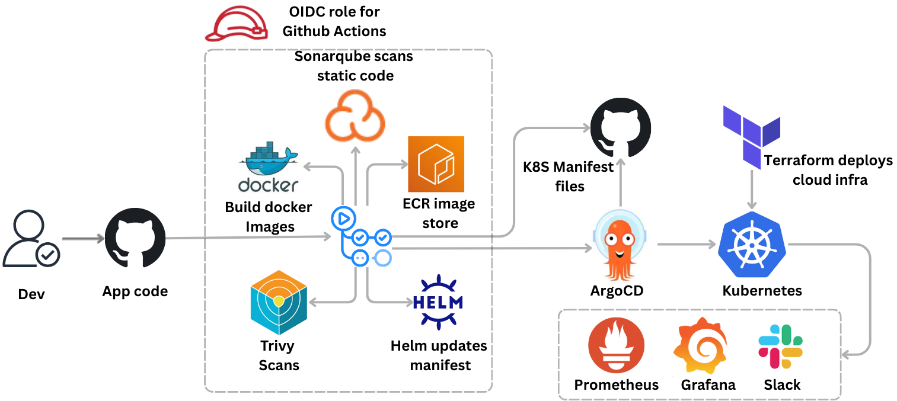

# lumiatech Java Application - Kubernetes Deployment

## Overview
This project deploys a Java web application (lumiatech) to a Kubernetes cluster using a GitOps approach with two separate repositories:
- **Application Repository**: Contains source code, Dockerfile, and CI/CD pipeline
- **Manifest Repository**: Contains Kubernetes manifests and Helm charts for deployment

## Architecture


- **Application**: Java Spring MVC application (WAR file)
- **Database**: MySQL 
- **Orchestration**: Kubernetes
- **Deployment Tool**: Helm
- **Ingress**: NGINX Ingress Controller

## Prerequisites
- Kubernetes cluster (v1.19+)
- kubectl configured
- Helm 3.x installed
- Docker registry access
- NGINX Ingress Controller installed in cluster

## Repository Structure

### Application Repository
```
lumiatech-app/
├── src/                    # Java source code
├── pom.xml                 # Maven build configuration
├── Dockerfile              # Container image definition
├── Jenkinsfile             # CI/CD pipeline
└── README.md
```

### Manifest Repository
```
lumiatech-manifests/
├── helm/
│   └── lumia/
│       ├── Chart.yaml
│       ├── values.yaml
│       └── templates/
│           ├── appdeploy.yaml
│           ├── appservice.yaml
│           ├── appingress.yaml
│           ├── dbdeploy.yaml
│           ├── dbservice.yaml
│           ├── dbpvc.yaml
│           └── secret.yaml
└── README.md
```

## Deployment Components

### Application Deployment
- **Image**: `vprocontainers/lumiatechapp`
- **Port**: 8080
- **Init Containers**: Wait for database and cache services
- **Service Type**: ClusterIP

### Database Deployment
- **Image**: `vprocontainers/lumiatechdb`
- **Port**: 3306
- **Storage**: PersistentVolumeClaim
- **Credentials**: Stored in Kubernetes Secret

### Ingress
- **Host**: `www.lumiatech.com`
- **Path**: `/`
- **Backend**: lumia-app-service:8080

## Deployment Steps

### 1. Clone Repositories
```bash
# Application repository
git clone <app-repo-url>

# Manifest repository
git clone <manifest-repo-url>
```

### 2. Create Namespace
```bash
kubectl create namespace lumiatech
kubectl config set-context --current --namespace=lumiatech
```

### 3. Deploy Using Helm
```bash
cd lumiatech-manifests/helm

# Install
helm install lumiatech ./lumiatech -n lumiatech

# Upgrade
helm upgrade lumiatech ./lumiatech -n lumiatech

# Rollback
helm rollback lumiatech -n lumiatech
```

### 4. Verify Deployment
```bash
kubectl get pods -n lumiatech
kubectl get svc -n lumiatech
kubectl get ingress -n lumiatech
```

### 5. Access Application
```bash
# Update /etc/hosts or DNS
echo "<INGRESS_IP> lumiatech.hkhinfoteck.xyz" >> /etc/hosts

# Access via browser
https://www.lumiatechs.com
```

## CI/CD Pipeline

### Build & Push
1. Maven builds WAR file
2. Docker builds container image
3. Image pushed to registry
4. Trigger manifest repository update

### Deploy
1. Update image tag in values.yaml
2. Commit to manifest repository
3. Helm upgrade deployment
4. Kubernetes rolls out new version

## Configuration

### Secrets
Update `secret.yaml` with base64 encoded values:
```bash
echo -n 'your-password' | base64
```

### Environment Variables
- `MYSQL_ROOT_PASSWORD`: Database root password (from secret)

### Persistent Storage
- Database uses PVC for data persistence
- Default storage class used

## Helm Values

Key values in `values.yaml`:
```yaml
app:
  image: vprocontainers/lumiatechapp
  tag: latest
  replicas: 1

db:
  image: vprocontainers/lumiatechdb
  tag: latest
  storage: 5Gi

ingress:
  host: www.lumiatech.com
```

## Monitoring & Troubleshooting

### Check Logs
```bash
kubectl logs -f deployment/lumia-app -n lumiatech
kubectl logs -f deployment/vprodb -n lumiatech
```

### Debug Pods
```bash
kubectl describe pod <pod-name> -n lumiatech
kubectl exec -it <pod-name> -n lumiatech -- /bin/bash
```

### Common Issues
- **Init containers stuck**: Check service DNS resolution
- **ImagePullBackOff**: Verify registry credentials
- **CrashLoopBackOff**: Check application logs and database connectivity

## Cleanup
```bash
helm uninstall lumiatech -n lumiatech
kubectl delete namespace lumiatech
```

## Security Considerations
- Secrets stored in Kubernetes Secret (consider using Sealed Secrets or External Secrets Operator)
- Use private container registry
- Implement RBAC policies
- Enable network policies
- Regular security scanning of images

## Future Enhancements
- Add Horizontal Pod Autoscaler (HPA)
- Implement monitoring with Prometheus/Grafana
- Add centralized logging with ELK/EFK stack
- Implement GitOps with ArgoCD/FluxCD
- Add health checks and readiness probes
- Implement blue-green or canary deployments
